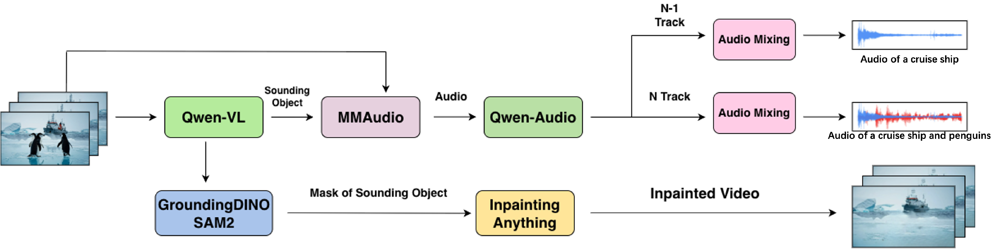

## Contents

<ol>
<li><a href="#introduction">Introduction</a></li>

<li><a href="#dataset-construction">Dataset Construction</a>
  <ul>
    <li><a href="#i-dataset-pipeline">Dataset Pipeline</a></li>
    <li><a href="#ii-savebench-examples">SAVEBench Examples</a></li>
    <li><a href="#iii-high-resolution-real-world-dataset">High Resolution Real-World Dataset</a></li>
  </ul>
</li>

<li><a href="#save-removal-performance">SAVE Removal Performance</a></li>

<li><a href="#generalizability">Generalizability</a>
  <ul>
    <li><a href="#single-object-removal">Single-Object Removal</a></li>
    <li><a href="#multi-object-removal">Multi-Object Removal</a></li>
  </ul>
</li>

<li><a href="#interactive-demo">Interactive Demo</a></li>

<li><a href="#more-examples">More Examples</a></li>
</ol>

---

## Introduction

**Schrödinger Audio-Visual Editor (SAVE)** presents a novel approach to object-level audio-visual removal. Our method enables precise removal of both visual objects and their corresponding sounds simultaneously, addressing a critical challenge in video editing.

  

Traditional video editing methods often struggle with joint audio-visual manipulation, either removing visual elements while leaving their sounds intact or vice versa. SAVE addresses this by:

- **Joint Audio-Visual Processing**: Simultaneous removal of visual objects and their corresponding audio
- **Object-Level Control**: Precise selection and removal of specific objects
- **High-Quality Results**: Maintaining synchronization after removal
- **Generalization**: Works across diverse real-world scenarios

## Dataset Construction

  
In this section, we present **SAVEBench**, the first audio-visual paired dataset for object-level editing task

### I. Dataset Pipeline

We show our synthetic pair-generation pipelines. For audio, we use Qwen-VL to enumerate sounding objects, then synthesize an object-centric track for each with MMAudio, and keep only tracks validated as clean by Qwen-Audio. We form \(N\!-\!1\) by mixing all retained tracks except one, and \(N\) by reintroducing the held-out track. For visual, we obtain object boxes with GroundingDINO and segmentation masks with SAM2. With the segmentation masks, we remove the corresponding objects with Inpaint-Anything on each frame of the video.

  

 
---

### II. SAVEBench Examples

**Example pairs from our SAVEBench dataset demonstrating various object removal scenarios.**

<table style="width: 100%; border-collapse: collapse;">
  <tr style="border-bottom: 2px solid #3b82f6;">
    <th style="text-align: center; padding: 10px; width: 50%; font-size: 1.2em;">Source</th>
    <th style="text-align: center; padding: 10px; width: 50%; font-size: 1.2em;">Target (Object Removed)</th>
  </tr>
  <tr>
    <td style="text-align: center; padding: 15px;">
      <strong style="font-size: 1.1em;">Sample 1: guitar</strong> 
      <video width="120" controls style="margin: 10px auto; display: block;">
        <source src="versionA/dataset_pair/-65Ee58UCQw/video_audio_src.mp4" type="video/mp4">
      </video>
    </td>
    <td style="text-align: center; padding: 15px;">
      <strong style="font-size: 1.1em;">Sample 1: guitar removed</strong> 
      <video width="120" controls style="margin: 10px auto; display: block;">
        <source src="versionA/dataset_pair/-65Ee58UCQw/video_audio_target.mp4" type="video/mp4">
      </video>
    </td>
  </tr>
  <tr style="background-color: #f8fafc;">
    <td style="text-align: center; padding: 15px;">
      <strong style="font-size: 1.1em;">Sample 2: speaker</strong> 
      <video width="120" controls style="margin: 10px auto; display: block;">
        <source src="versionA/dataset_pair/-bfIrdu5yEo/video_audio_src.mp4" type="video/mp4">
      </video>
    </td>
    <td style="text-align: center; padding: 15px;">
      <strong style="font-size: 1.1em;">Sample 2: speaker removed</strong> 
      <video width="120" controls style="margin: 10px auto; display: block;">
        <source src="versionA/dataset_pair/-bfIrdu5yEo/video_audio_target.mp4" type="video/mp4">
      </video>
    </td>
  </tr>
  <tr>
    <td style="text-align: center; padding: 15px;">
      <strong style="font-size: 1.1em;">Sample 3: man</strong> 
      <video width="120" controls style="margin: 10px auto; display: block;">
        <source src="versionA/dataset_pair/-gNn39_SfMM/video_audio_src.mp4" type="video/mp4">
      </video>
    </td>
    <td style="text-align: center; padding: 15px;">
      <strong style="font-size: 1.1em;">Sample 3: man removed</strong> 
      <video width="120" controls style="margin: 10px auto; display: block;">
        <source src="versionA/dataset_pair/-gNn39_SfMM/video_audio_target.mp4" type="video/mp4">
      </video>
    </td>
  </tr>
</table>

---

### III: High Resolution Real-World Dataset

**High-resolution real-world video pairs from Documentaries**

<table style="width: 100%; border-collapse: collapse;">
  <tr style="border-bottom: 2px solid #3b82f6;">
    <th style="text-align: center; padding: 10px; width: 50%; font-size: 1.2em;">Source</th>
    <th style="text-align: center; padding: 10px; width: 50%; font-size: 1.2em;">Target (Object Removed)</th>
  </tr>
  <tr>
    <td style="text-align: center; padding: 15px;">
      <strong style="font-size: 1.1em;">Sample 1: violin</strong> 
      <video width="120" controls style="margin: 10px auto; display: block;">
        <source src="versionA/dataset_pair/-il1SY0ZSi8/video_audio_src.mp4" type="video/mp4">
      </video>
    </td>
    <td style="text-align: center; padding: 15px;">
      <strong style="font-size: 1.1em;">Sample 1: violin removed</strong> 
      <video width="120" controls style="margin: 10px auto; display: block;">
        <source src="versionA/dataset_pair/-il1SY0ZSi8/video_audio_target.mp4" type="video/mp4">
      </video>
    </td>
  </tr>
  <tr style="background-color: #f8fafc;">
    <td style="text-align: center; padding: 15px;">
      <strong style="font-size: 1.1em;">Sample 2: machine</strong> 
      <video width="120" controls style="margin: 10px auto; display: block;">
        <source src="versionA/dataset_pair/-a4Z0Xi4K18/video_audio_src.mp4" type="video/mp4">
      </video>
    </td>
    <td style="text-align: center; padding: 15px;">
      <strong style="font-size: 1.1em;">Sample 2: machine removed</strong> 
      <video width="120" controls style="margin: 10px auto; display: block;">
        <source src="versionA/dataset_pair/-a4Z0Xi4K18/video_audio_target.mp4" type="video/mp4">
      </video>
    </td>
  </tr>
  <tr>
    <td style="text-align: center; padding: 15px;">
      <strong style="font-size: 1.1em;">Sample 3: cat</strong> 
      <video width="120" controls style="margin: 10px auto; display: block;">
        <source src="versionA/dataset_pair/-f3amaXRaHs/video_audio_src.mp4" type="video/mp4">
      </video>
    </td>
    <td style="text-align: center; padding: 15px;">
      <strong style="font-size: 1.1em;">Sample 3: cat removed</strong> 
      <video width="120" controls style="margin: 10px auto; display: block;">
        <source src="versionA/dataset_pair/-f3amaXRaHs/video_audio_target.mp4" type="video/mp4">
      </video>
    </td>
  </tr>
</table>

## SAVE Removal Performance

  
In this section, we present some editing results with SAVE editor

<table style="width: 100%; border-collapse: collapse;">
  <tr style="border-bottom: 2px solid #3b82f6;">
    <th style="text-align: center; padding: 10px; width: 50%; font-size: 1.2em;">Source</th>
    <th style="text-align: center; padding: 10px; width: 50%; font-size: 1.2em;">Target (Object Removed)</th>
  </tr>
  <tr>
    <td style="text-align: center; padding: 15px;">
      <strong style="font-size: 1.1em;">Sample 1: violin</strong> 
      <video width="120" controls style="margin: 10px auto; display: block;">
        <source src="versionA/dataset_pair/-il1SY0ZSi8/video_audio_src.mp4" type="video/mp4">
      </video>
    </td>
    <td style="text-align: center; padding: 15px;">
      <strong style="font-size: 1.1em;">Sample 1: violin removed</strong> 
      <video width="120" controls style="margin: 10px auto; display: block;">
        <source src="versionA/dataset_pair/-il1SY0ZSi8/video_audio_target.mp4" type="video/mp4">
      </video>
    </td>
  </tr>
  <tr style="background-color: #f8fafc;">
    <td style="text-align: center; padding: 15px;">
      <strong style="font-size: 1.1em;">Sample 2: machine</strong> 
      <video width="120" controls style="margin: 10px auto; display: block;">
        <source src="versionA/dataset_pair/-a4Z0Xi4K18/video_audio_src.mp4" type="video/mp4">
      </video>
    </td>
    <td style="text-align: center; padding: 15px;">
      <strong style="font-size: 1.1em;">Sample 2: machine removed</strong> 
      <video width="120" controls style="margin: 10px auto; display: block;">
        <source src="versionA/dataset_pair/-a4Z0Xi4K18/video_audio_target.mp4" type="video/mp4">
      </video>
    </td>
  </tr>
  <tr>
    <td style="text-align: center; padding: 15px;">
      <strong style="font-size: 1.1em;">Sample 3: cat</strong> 
      <video width="120" controls style="margin: 10px auto; display: block;">
        <source src="versionA/dataset_pair/-f3amaXRaHs/video_audio_src.mp4" type="video/mp4">
      </video>
    </td>
    <td style="text-align: center; padding: 15px;">
      <strong style="font-size: 1.1em;">Sample 3: cat removed</strong> 
      <video width="120" controls style="margin: 10px auto; display: block;">
        <source src="versionA/dataset_pair/-f3amaXRaHs/video_audio_target.mp4" type="video/mp4">
      </video>
    </td>
  </tr>
</table>

## Generalizability

  
Examples showing SAVE's ability to generalize to diverse real-world scenarios

### Single-Object Removal

<table style="width: 100%; border-collapse: collapse;">
  <tr style="border-bottom: 2px solid #3b82f6;">
    <th style="text-align: center; padding: 10px; width: 50%;">Source</th>
    <th style="text-align: center; padding: 10px; width: 50%; font-size: 1.2em;">Output (SAVE)</th>
  </tr>
  <tr>
    <td style="text-align: center; padding: 15px;">
      <strong style="font-size: 1.1em;">Target Object: tree</strong> 
      <video width="120" controls style="margin: 10px auto; display: block;">
        <source src="general/edit_result/single_object/tree_src.mp4" type="video/mp4">
      </video>
    </td>
    <td style="text-align: center; padding: 15px;">
      <strong style="font-size: 1.1em;">tree removed</strong> 
      <video width="120" controls style="margin: 10px auto; display: block;">
        <source src="general/edit_result/single_object/tree_generated.mp4" type="video/mp4">
      </video>
    </td>
  </tr>
  <tr style="background-color: #f8fafc;">
    <td style="text-align: center; padding: 15px;">
      <strong style="font-size: 1.1em;">Target Object: orange</strong> 
      <video width="120" controls style="margin: 10px auto; display: block;">
        <source src="general/edit_result/single_object/orange_src.mp4" type="video/mp4">
      </video>
    </td>
    <td style="text-align: center; padding: 15px;">
      <strong style="font-size: 1.1em;">orange removed</strong> 
      <video width="120" controls style="margin: 10px auto; display: block;">
        <source src="general/edit_result/single_object/orange_generated.mp4" type="video/mp4">
      </video>
    </td>
  </tr>
  <tr>
    <td style="text-align: center; padding: 15px;">
      <strong style="font-size: 1.1em;">Target Object: table</strong> 
      <video width="120" controls style="margin: 10px auto; display: block;">
        <source src="general/edit_result/single_object/table_src.mp4" type="video/mp4">
      </video>
    </td>
    <td style="text-align: center; padding: 15px;">
      <strong style="font-size: 1.1em;">table removed</strong> 
      <video width="120" controls style="margin: 10px auto; display: block;">
        <source src="general/edit_result/single_object/table_generated.mp4" type="video/mp4">
      </video>
    </td>
  </tr>
</table>

### Multi-Object Removal

<table style="width: 100%; border-collapse: collapse;">
  <tr style="border-bottom: 2px solid #3b82f6;">
    <th style="text-align: center; padding: 10px; width: 50%;">Source</th>
    <th style="text-align: center; padding: 10px; width: 50%; font-size: 1.2em;">Output (SAVE)</th>
  </tr>
  <tr>
    <td style="text-align: center; padding: 15px;">
      <strong style="font-size: 1.1em;">Target Objects: cat and dog</strong> 
      <video width="120" controls style="margin: 10px auto; display: block;">
        <source src="general/edit_result/multi_object/cat_dog_src.mp4" type="video/mp4">
      </video>
    </td>
    <td style="text-align: center; padding: 15px;">
      <strong style="font-size: 1.1em;">cat and dog removed</strong> 
      <video width="120" controls style="margin: 10px auto; display: block;">
        <source src="general/edit_result/multi_object/cat_dog_generated.mp4" type="video/mp4">
      </video>
    </td>
  </tr>
</table>

## Interactive Demo

Coming Soon!
<!-- Try our audio-visual editor directly in your browser! -->

<!-- 

  <iframe 
    src="YOUR_GRADIO_DEMO_URL"
    frameborder="0" 
    width="100%" 
    height="800"
    class="gradio-frame">
  </iframe>

  
<strong>Note:</strong> Replace <code>YOUR_GRADIO_DEMO_URL</code> with your actual Gradio Space URL (e.g., <code>https://huggingface.co/spaces/username/space-name</code>)

 -->

##  More Examples

  
Additional examples demonstrating the versatility and robustness of our audio-visual editor.

<table style="width: 100%; border-collapse: collapse;">
  <tr style="border-bottom: 2px solid #3b82f6;">
    <th style="text-align: center; padding: 10px; width: 50%;">Source</th>
    <th style="text-align: center; padding: 10px; width: 50%; font-size: 1.2em;">SAVE (Ours)</th>
  </tr>
  <tr>
    <td style="text-align: center; padding: 15px;">
      <strong style="font-size: 1.1em;">Target Object: alarm clock</strong> 
      <video width="120" controls style="margin: 10px auto; display: block;">
        <source src="versionB/edit_result/-fDcLLON3zs/save/video_audio_src.mp4" type="video/mp4">
      </video>
    </td>
    <td style="text-align: center; padding: 15px;">
      <strong style="font-size: 1.1em;">alarm clock removed</strong> 
      <video width="120" controls style="margin: 10px auto; display: block;">
        <source src="versionB/edit_result/-fDcLLON3zs/save/video_audio_generated.mp4" type="video/mp4">
      </video>
    </td>
  </tr>
</table>

<table style="width: 100%; border-collapse: collapse;">
  <tr style="border-bottom: 2px solid #3b82f6;">
    <th style="text-align: center; padding: 10px; width: 50%;">Source</th>
    <th style="text-align: center; padding: 10px; width: 50%; font-size: 1.2em;">SAVE (Ours)</th>
  </tr>
  <tr>
    <td style="text-align: center; padding: 15px;">
      <strong style="font-size: 1.1em;">Target Object: plow</strong> 
      <video width="120" controls style="margin: 10px auto; display: block;">
        <source src="versionB/edit_result/audioset_balanced_train_3L8swdSZj5w_10.000/save/video_audio_src.mp4" type="video/mp4">
      </video>
    </td>
    <td style="text-align: center; padding: 15px;">
      <strong style="font-size: 1.1em;">plow removed</strong> 
      <video width="120" controls style="margin: 10px auto; display: block;">
        <source src="versionB/edit_result/audioset_balanced_train_3L8swdSZj5w_10.000/save/video_audio_generated.mp4" type="video/mp4">
      </video>
    </td>
  </tr>
</table>

<table style="width: 100%; border-collapse: collapse;">
  <tr style="border-bottom: 2px solid #3b82f6;">
    <th style="text-align: center; padding: 10px; width: 50%;">Source</th>
    <th style="text-align: center; padding: 10px; width: 50%; font-size: 1.2em;">SAVE (Ours)</th>
  </tr>
  <tr>
    <td style="text-align: center; padding: 15px;">
      <strong style="font-size: 1.1em;">Target Object: fire truck</strong> 
      <video width="120" controls style="margin: 10px auto; display: block;">
        <source src="versionA/edit_result/audioset_balanced_train_-z47zN0YyE4_420.000/save/video_audio_src.mp4" type="video/mp4">
      </video>
    </td>
    <td style="text-align: center; padding: 15px;">
      <strong>fire truck removed</strong> 
      <video width="120" controls style="margin: 10px auto; display: block;">
        <source src="versionA/edit_result/audioset_balanced_train_-z47zN0YyE4_420.000/save/video_audio_generated.mp4" type="video/mp4">
      </video>
    </td>
  </tr>
</table>

<table style="width: 100%; border-collapse: collapse;">
  <tr style="border-bottom: 2px solid #3b82f6;">
    <th style="text-align: center; padding: 10px; width: 50%;">Source</th>
    <th style="text-align: center; padding: 10px; width: 50%; font-size: 1.2em;">SAVE (Ours)</th>
  </tr>
  <tr>
    <td style="text-align: center; padding: 15px;">
      <strong style="font-size: 1.1em;">Target Object: man</strong> 
      <video width="120" controls style="margin: 10px auto; display: block;">
        <source src="versionA/edit_result/audioset_eval_aXV-yaFmQNk_70.000/save/video_audio_src.mp4" type="video/mp4">
      </video>
    </td>
    <td style="text-align: center; padding: 15px;">
      <strong style="font-size: 1.1em;">man removed</strong> 
      <video width="120" controls style="margin: 10px auto; display: block;">
        <source src="versionA/edit_result/audioset_eval_aXV-yaFmQNk_70.000/save/video_audio_generated.mp4" type="video/mp4">
      </video>
    </td>
  </tr>
</table>

<table style="width: 100%; border-collapse: collapse;">
  <tr style="border-bottom: 2px solid #3b82f6;">
    <th style="text-align: center; padding: 10px; width: 50%;">Source</th>
    <th style="text-align: center; padding: 10px; width: 50%; font-size: 1.2em;">SAVE (Ours)</th>
  </tr>
  <tr>
    <td style="text-align: center; padding: 15px;">
      <strong style="font-size: 1.1em;">Target Object: fireworks</strong> 
      <video width="120" controls style="margin: 10px auto; display: block;">
        <source src="versionA/edit_result/kling_explosion_2210/save/video_audio_src.mp4" type="video/mp4">
      </video>
    </td>
    <td style="text-align: center; padding: 15px;">
      <strong style="font-size: 1.1em;">fireworks removed</strong> 
      <video width="120" controls style="margin: 10px auto; display: block;">
        <source src="versionA/edit_result/kling_explosion_2210/save/video_audio_generated.mp4" type="video/mp4">
      </video>
    </td>
  </tr>
</table>

<table style="width: 100%; border-collapse: collapse;">
  <tr style="border-bottom: 2px solid #3b82f6;">
    <th style="text-align: center; padding: 10px; width: 50%;">Source</th>
    <th style="text-align: center; padding: 10px; width: 50%; font-size: 1.2em;">SAVE (Ours)</th>
  </tr>
  <tr>
    <td style="text-align: center; padding: 15px;">
      <strong style="font-size: 1.1em;">Target Object: motorcycle</strong> 
      <video width="120" controls style="margin: 10px auto; display: block;">
        <source src="versionA/edit_result/kling_motorvehicleroad_20512/save/video_audio_src.mp4" type="video/mp4">
      </video>
    </td>
    <td style="text-align: center; padding: 15px;">
      <strong style="font-size: 1.1em;">motorcycle removed</strong> 
      <video width="120" controls style="margin: 10px auto; display: block;">
        <source src="versionA/edit_result/kling_motorvehicleroad_20512/save/video_audio_generated.mp4" type="video/mp4">
      </video>
    </td>
  </tr>
</table>

<table style="width: 100%; border-collapse: collapse;">
  <tr style="border-bottom: 2px solid #3b82f6;">
    <th style="text-align: center; padding: 10px; width: 50%;">Source</th>
    <th style="text-align: center; padding: 10px; width: 50%; font-size: 1.2em;">SAVE (Ours)</th>
  </tr>
  <tr>
    <td style="text-align: center; padding: 15px;">
      <strong style="font-size: 1.1em;">Target Object: airplane</strong> 
      <video width="120" controls style="margin: 10px auto; display: block;">
        <source src="versionB/edit_result/kling_aircraft_22329/save/video_audio_src.mp4" type="video/mp4">
      </video>
    </td>
    <td style="text-align: center; padding: 15px;">
      <strong style="font-size: 1.1em;">airplane removed</strong> 
      <video width="120" controls style="margin: 10px auto; display: block;">
        <source src="versionB/edit_result/kling_aircraft_22329/save/video_audio_generated.mp4" type="video/mp4">
      </video>
    </td>
  </tr>
</table>

<table style="width: 100%; border-collapse: collapse;">
  <tr style="border-bottom: 2px solid #3b82f6;">
    <th style="text-align: center; padding: 10px; width: 50%;">Source</th>
    <th style="text-align: center; padding: 10px; width: 50%; font-size: 1.2em;">SAVE (Ours)</th>
  </tr>
  <tr>
    <td style="text-align: center; padding: 15px;">
      <strong style="font-size: 1.1em;">Target Object: bulldozer</strong> 
      <video width="120" controls style="margin: 10px auto; display: block;">
        <source src="versionB/edit_result/kling_mechanisms_9147/save/video_audio_src.mp4" type="video/mp4">
      </video>
    </td>
    <td style="text-align: center; padding: 15px;">
      <strong style="font-size: 1.1em;">bulldozer removed</strong> 
      <video width="120" controls style="margin: 10px auto; display: block;">
        <source src="versionB/edit_result/kling_mechanisms_9147/save/video_audio_generated.mp4" type="video/mp4">
      </video>
    </td>
  </tr>
</table>